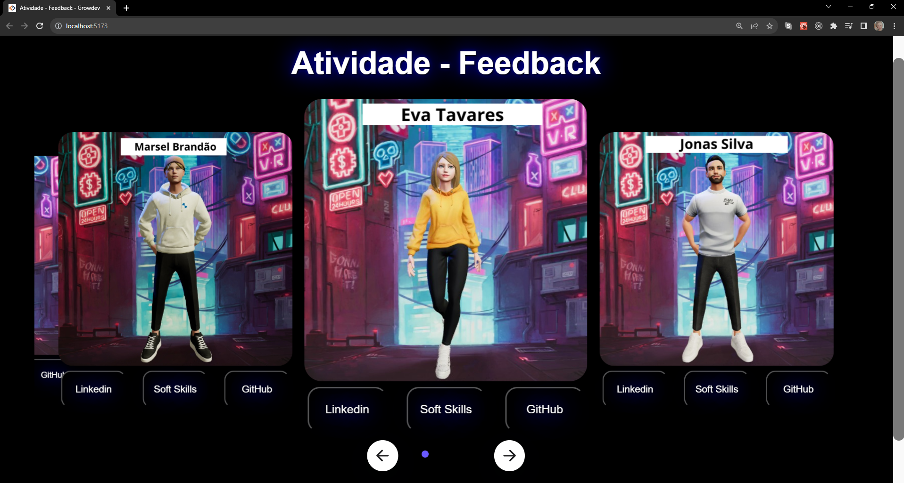
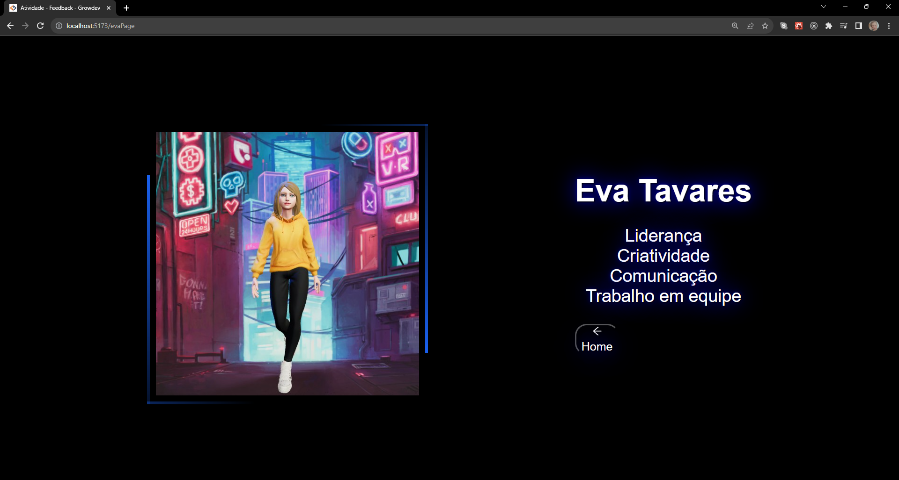
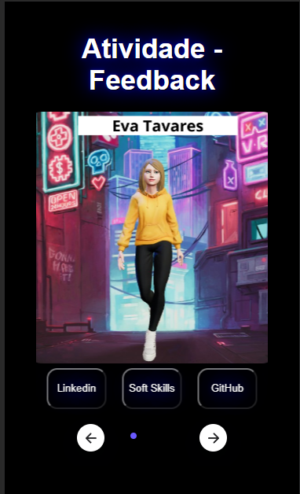
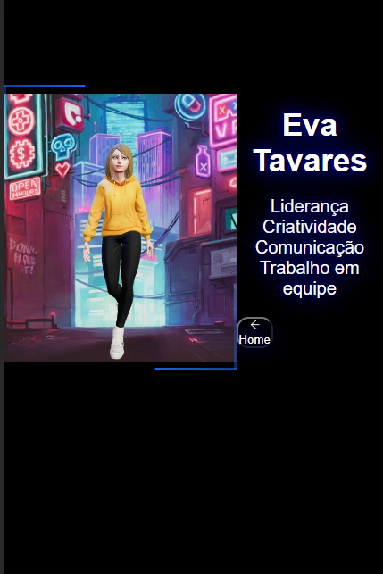

<h1 text-align="center">Soft Skills application - Atividade feedback growdev</h1>

## :memo: Descrição

Esse é o resultado da Atividade de Feedback do módulo de Orientação Profissional da Growdev.

O objetivo dessa atividade era listar softskills como feedback entre os membros da equipe e utilizar os conhecimentos técnicos aprendidos no curso Start Full Stack Web Developer para ilustrar tudo isso.
A aplicação foi desenvolvida com ReactJ, possui uma uma página principal que contém um carrosel de cards dinâmico.

### Acesse a aplicação no link abaixo :arrow_down: :arrow_down:
:arrow_right:[Link de acesso](https://portfolio-colegas-growdev.vercel.app/)

---

 

 
 ### :computer: Visualização Desktop 
 
 

 ###  :iphone: Visualização mobile

 
 
 

## :books: Funcionalidades
* <b>Responsividade</b>: website totalmente responsivo.
* <b>Carrosel</b>: Slide de cards, onde cada card possui três botões e corresponde ao avatar de um membro da equipe. Cada botão te leva para uma página diferente, seja ela externa como o link para o Github e para o Linkedin ou interna utilizando rotas, 
onde cada rota te direciona para uma tela com a lista de softskills de cada integrante do grupo.

##  :wrench: Tecnologias utilizadas

* 
* 
* 

## :handshake: Colaboradores
* <table>
  <tr>
    <td text-align="center">
      <a href="https://github.com/jonas-amilton">
        
          <b>Jonas Silva</b>
        
      </a>
    </td>
    <td text-align="center">
      <a href="https://github.com/Roberto1501">
        
          <b>Roberto Carvalho</b>
        
      </a>
    </td>
     <td text-align="center">
      <a href="https://github.com/Marseljrdev">
        
          <b>Marsel Brandão</b>
        
      </a>
    </td>
  </tr>
</table>
